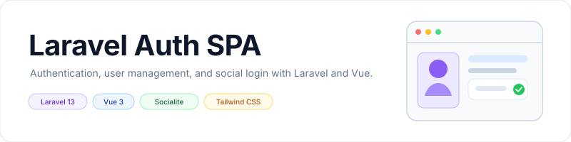

<p align="center">
    <picture>
        <source media="(prefers-color-scheme: dark)" srcset="art/banner-dark.svg">
        <source media="(prefers-color-scheme: light)" srcset="art/banner-light.svg">
        
    </picture>
</p>

<p align="center">Laravel authentication and user management SPA built with Laravel 13, Vue 3, Socialite, Vite, and Tailwind CSS.</p>

<p align="center">
    <a href="https://github.com/jeremykenedy/laravel-spa/releases"></a>
    <a href="https://github.com/jeremykenedy/laravel-spa/actions/workflows/codeql.yml"></a>
    <a href="https://sonarcloud.io/summary/new_code?id=jeremykenedy_laravel-spa"></a>
    <a href="https://madewithvuejs.com/p/laravel-auth-spa/shield-link"></a>
    <a href="https://github.com/jeremykenedy/laravel-spa/actions/workflows/php.yml"></a>
    <a href="https://github.styleci.io/repos/537735029?branch=master"></a>
    <a href="https://opensource.org/licenses/MIT"></a>
</p>

<p align="center">
    <a href="https://github.com/jeremykenedy"></a>
    <a href="https://github.com/jeremykenedy/laravel-spa/stargazers"></a>
    <a href="https://github.com/sponsors/jeremykenedy"></a>
</p>

## Table of Contents

- [About](#about)
- [Features](#features)
  - [Built on](#built-on)
  - [Feature list](#feature-list)
- [Requirements](#requirements)
- [Installation](#installation)
  - [Build the Front End Assets with Vite](#build-the-front-end-assets-with-vite)
  - [Using npm](#using-npm)
  - [Using Yarn](#using-yarn)
  - [Optionally Build Cache](#optionally-build-cache)
- [Seeds](#seeds)
  - [Seeded Users](#seeded-users)
- [Socialite](#socialite)
  - [Get Socialite Login API Keys](#get-socialite-login-api-keys)
  - [Add More Socialite Logins](#add-more-socialite-logins)
- [Testing](#testing)
- [Screenshots](#screenshots)
  - [Desktop screenshots](#desktop-screenshots)
  - [Mobile screenshots](#mobile-screenshots)
- [File Tree](#file-tree)
- [License](#license)

## About
A Laravel + Socialite + Vite + Vue 3 + TailwindCSS SPA Boilerplate.
Laravel with user authentication, registration with email verification,
social media authentication, password recovery, user management, and roles/permissions
management. Uses official [TailwindCSS](https://tailwindcss.com/). While the front end is
part of this repository it is a completely separated Vue 3 front end compiled using ViteJS.

## Features
### Built on
- [Laravel 13.x](https://github.com/laravel/laravel)
- [Laravel Sanctum](https://laravel.com/docs/11.x/sanctum)
- [Socialite](https://laravel.com/docs/11.x/socialite)
- [Vite](https://laravel.com/docs/9.x/vite)
- [Vue 3](https://github.com/vuejs/vue)
- [TailwindCSS 4 (w/ `@tailwindcss/forms` and `@tailwindcss/typography`)](https://tailwindcss.com/)
- [Vue Router](https://router.vuejs.org/)
- [Pinia](https://pinia.vuejs.org/)
- [Axios](https://axios-http.com/)
- [Vue I18n](https://vue-i18n.intlify.dev)
- [Headless UI](https://headlessui.com/)
- [Heroicons](https://heroicons.com/)
- [Font Awesome 7](https://fontawesome.com/search)
- [ESLint](https://eslint.org/) with [Prettier](https://prettier.io/docs/en/index.html)

### Feature list
- Users Area
- Admin Area
- About Page
- Terms Page
- Users Managemenet
- User Impersonation
- User Data Download
- User Account Self Deletion.
- Manage Social Media Logins through GUI
- [Roles Management](https://github.com/jeremykenedy/laravel-roles)
- [Permissions Management](https://github.com/jeremykenedy/laravel-roles)
- [Google Analytics (optional)](https://matteo-gabriele.gitbook.io/vue-gtag/v/next/)
- [Social Authentication with Facebook, Twitter, Instagram, GitHub, TikTok, Google, YouTube, Microsoft, Twitch, and Apple](https://laravel.com/docs/9.x/socialite)
- [Optional Sentry.io Laravel Monitoring](https://docs.sentry.io/platforms/php/guides/laravel/)
- [Optional Sentry.io VueJs Monitoring](https://docs.sentry.io/platforms/javascript/guides/vue/)

The following Sanctum features are implemented in this Vue SPA:

- ✅ Laravel 13
- ✅ Vue 3
- ✅ VueRouter
- ✅ Pinia
- ✅ Vue I18n Multi-Language
- ✅ Login
- ✅ Password Reset
- ✅ Registration
- ✅ Admin Panel
- ✅ Profile Management
- ✅ User Management
- ✅ Roles Management
- ✅ Permissions Management
- ✅ Password Change
- ✅ E-Mail Verification
- ✅ Posts Management
- ✅ Frontend Blog
- ✅ TailwindCSS
- ✅ Browser Sessions - Other Device Logout
- ✅ User Activity Logs

## Requirements

**Requirements:** PHP >= 8.4, Composer, and Node.js >= 22.13 (this repo's `.nvmrc` pins Node 24).

## Installation

1. Run `git clone https://github.com/jeremykenedy/laravel-spa.git laravel-spa`
2. Create a MySQL database for the project
    * ```mysql -u root -p```, if using Vagrant: ```mysql -u homestead -psecret```
    * ```create database laravelSpa;```
    * ```\q```
3. From the projects root run `cp .env.example .env`
4. Configure your `.env` file (VERY IMPORTANT)
5. Run `composer install` from the projects root folder
6. From the projects root folder run `sudo chmod -R 755 ../laravel-spa`
7. From the projects root folder run `php artisan key:generate`
8. From the projects root folder run `php artisan migrate`
9. From the projects root folder run `composer dump-autoload`
10. From the projects root folder run `php artisan db:seed`
11. Compile the front end assets with [npm steps](#using-npm) or [yarn steps](#using-yarn).

### Build the Front End Assets with Vite
#### Using npm:
1. From the projects root folder run `npm install`
2. From the projects root folder run `npm run dev` or `npm run build`
  * You can lint assets with `npm run lint`
  * You can clean the syntax with `npm run clean`

#### Using Yarn:
1. From the projects root folder run `yarn install`
2. From the projects root folder run `yarn run dev` or `yarn run build`
  * You can lint assets with `yarn run lint`
  * You can clean the syntax with `yarn run clean`

### Optionally Build Cache
1. From the projects root folder run `php artisan config:cache`

That's it, with the caveat that you need to set up and configure your development environment.

## Seeds

### Seeded Users

|Email|Password|
|:------------|:------------|
|superadmin@superadmin.com|password|
|admin@admin.com|password|
|user@user.com|password|

## Socialite

### Get Socialite Login API Keys
* [Facebook API](https://developers.facebook.com/) (Will work with local dev callback)
* [Twitter API](https://apps.twitter.com/)
* [Instagram API](https://instagram.com/developer/register/)
* [GitHub API](https://github.com/settings/applications/new) (Will work with local dev callback)
* [YouTube API](https://developers.google.com/youtube/v3/getting-started)
* [Google API](https://console.developers.google.com/)
* [LinkedIn API](https://www.linkedin.com/developers/apps/) (Will work with local dev callback)
* [Twitch API](https://dev.twitch.tv/docs/authentication/) (Will work with local dev callback)
* [Microsoft API]()
* [TikTok API](https://developers.tiktok.com/)
* [Apple API](https://developer.okta.com/blog/2019/06/04/what-the-heck-is-sign-in-with-apple)
* [ZoHo API](https://api-console.zoho.com/) (Will work with local dev callback)
* [StackExchange API](https://stackapps.com/apps/oauth/register/) (Will work with local dev callback)
* [GitLab API](https://gitlab.com/oauth/applications) (Will work with local dev callback)
* [Reddit API](https://www.reddit.com/prefs/apps) [Register](https://docs.google.com/a/reddit.com/forms/d/e/1FAIpQLSezNdDNK1-P8mspSbmtC2r86Ee9ZRbC66u929cG2GX0T9UMyw/viewform) (Will work with local dev callback)
* [Snapchat API](https://devportal.snap.com/manage/)
* [Meetup API](https://www.meetup.com/api/oauth/list/)
* [Atlassian](https://developer.atlassian.com/console/myapps/)

### Add More Socialite Logins
* See full list of providers: [https://socialiteproviders.github.io](https://socialiteproviders.com/about/)

## Testing

The CI workflows validate Composer configuration and installation, generate an application key, lint the Vue application, and build the frontend assets. Run the same checks locally:

```bash
composer validate --strict
npm install
npm run lint
npm run build
```

The repository also includes Laravel feature and unit tests. Run them with `php artisan test` after installing Composer dependencies and configuring the application environment.

## Screenshots

### Desktop screenshots

<p align="center">
  <a href="https://laravel-spa.s3.us-west-2.amazonaws.com/v3/login-sm.png"></a>
  <a href="https://laravel-spa.s3.us-west-2.amazonaws.com/v3/login-sm-tiktok.png"></a>
  <a href="https://laravel-spa.s3.us-west-2.amazonaws.com/v3/register-sm-instagram.png"></a>
  <a href="https://laravel-spa.s3.us-west-2.amazonaws.com/v3/register-sm.png"></a>
  <a href="https://laravel-spa.s3.us-west-2.amazonaws.com/v3/dashboard-success-login-sm.png"></a>
  <a href="https://laravel-spa.s3.us-west-2.amazonaws.com/v3/admin-dashboard.png"></a>
  <a href="https://laravel-spa.s3.us-west-2.amazonaws.com/v3/admin-users.png"></a>
  <a href="https://laravel-spa.s3.us-west-2.amazonaws.com/v3/admin-roles.png"></a>
  <a href="https://laravel-spa.s3.us-west-2.amazonaws.com/v3/admin-permissions.png"></a>
  <a href="https://laravel-spa.s3.us-west-2.amazonaws.com/v3/admin-app-settings.png"></a>
  <a href="https://laravel-spa.s3.us-west-2.amazonaws.com/home.png"></a>
  <a href="https://laravel-spa.s3.us-west-2.amazonaws.com/about.png"></a>
  <a href="https://laravel-spa.s3.us-west-2.amazonaws.com/login.png"></a>
  <a href="https://laravel-spa.s3.us-west-2.amazonaws.com/register.png"></a>
  <a href="https://laravel-spa.s3.us-west-2.amazonaws.com/dashboard.png"></a>
  <a href="https://laravel-spa.s3.us-west-2.amazonaws.com/profile1.png"></a>
  <a href="https://laravel-spa.s3.us-west-2.amazonaws.com/profile2.png"></a>
  <a href="https://laravel-spa.s3.us-west-2.amazonaws.com/profile3.png"></a>
  <a href="https://laravel-spa.s3.us-west-2.amazonaws.com/v3.1/settings-account-auth.png"></a>
  <a href="https://laravel-spa.s3.us-west-2.amazonaws.com/v3.1/settings-account-auth-revoke.png"></a>
  <a href="https://laravel-spa.s3.us-west-2.amazonaws.com/v3.1/settings-account-delete.png"></a>
  <a href="https://laravel-spa.s3.us-west-2.amazonaws.com/v3.1/settings-account-delete-confirm.png"></a>
  <a href="https://laravel-spa.s3.us-west-2.amazonaws.com/v3.1/account-deleted.png"></a>
  <a href="https://laravel-spa.s3.us-west-2.amazonaws.com/v3.1/terms.png"></a>
  <a href="https://laravel-spa.s3.us-west-2.amazonaws.com/forgot.png"></a>
  <a href="https://laravel-spa.s3.us-west-2.amazonaws.com/reset.png"></a>
</p>

### Mobile screenshots

<p align="center">
  <a href="https://laravel-spa.s3.us-west-2.amazonaws.com/mobile-menu.png"></a>
  <a href="https://laravel-spa.s3.us-west-2.amazonaws.com/mobile-login.png"></a>
</p>

## File Tree
```
LaravelSpa
├── .editorconfig
├── .env.example
├── .gitattributes
├── .github
│   ├── dependabot.yml
│   ├── FUNDING.yml
│   ├── labeler.yml
│   └── workflows
│       ├── build-changelog.yml
│       ├── codacy.yml
│       ├── codeql.yml
│       ├── dependency-review.yml
│       ├── deploy.yml
│       ├── gitguardian.yml
│       ├── greetings.yml
│       ├── labeler.yml
│       ├── laravel.yml
│       ├── node.js.yml
│       ├── php.yml
│       ├── sentry.yml
│       └── stale.yml
├── .gitignore
├── .nvmrc
├── .phpunit.result.cache
├── .prettierignore
├── .prettierrc.json
├── .scripts
│   └── deploy.sh
├── .styleci.yml
├── app
│   ├── Exceptions
│   │   └── SocialProviderDeniedException.php
│   ├── Http
│   │   ├── Controllers
│   │   │   ├── Admin
│   │   │   │   ├── AppSettingsController.php
│   │   │   │   ├── DashboardController.php
│   │   │   │   └── ServerInfoController.php
│   │   │   ├── Api
│   │   │   │   ├── ActivityLogController.php
│   │   │   │   ├── BrowserSessionController.php
│   │   │   │   ├── CategoryController.php
│   │   │   │   ├── PermissionsController.php
│   │   │   │   ├── PostController.php
│   │   │   │   ├── ProfileController.php
│   │   │   │   ├── RolesController.php
│   │   │   │   ├── UserController.php
│   │   │   │   └── UsersController.php
│   │   │   ├── Auth
│   │   │   │   ├── AuthenticatedSessionController.php
│   │   │   │   ├── ConfirmPasswordController.php
│   │   │   │   ├── ForgotPasswordController.php
│   │   │   │   ├── ImpersonateController.php
│   │   │   │   ├── LoginController.php
│   │   │   │   ├── PasswordController.php
│   │   │   │   ├── RegisterController.php
│   │   │   │   ├── ResetPasswordController.php
│   │   │   │   ├── SocialiteController.php
│   │   │   │   └── VerificationController.php
│   │   │   ├── Controller.php
│   │   │   └── HomeController.php
│   │   ├── Requests
│   │   │   ├── Admin
│   │   │   │   ├── AdminDashboardRequest.php
│   │   │   │   ├── ShowAppSettingsRequest.php
│   │   │   │   ├── ShowServerInfoRequest.php
│   │   │   │   └── UpdateAppSettingsRequest.php
│   │   │   ├── Auth
│   │   │   │   ├── LoginRequest.php
│   │   │   │   └── RegisterRequest.php
│   │   │   ├── Categories
│   │   │   │   ├── DeleteCategoryRequest.php
│   │   │   │   ├── RestoreCategoryRequest.php
│   │   │   │   ├── ShowCategoryRequest.php
│   │   │   │   ├── StoreCategoryRequest.php
│   │   │   │   └── UpdateCategoryRequest.php
│   │   │   ├── Permissions
│   │   │   │   ├── CreatePermissionRequest.php
│   │   │   │   ├── GetPermissionsRequest.php
│   │   │   │   └── UpdatePermissionRequest.php
│   │   │   ├── Posts
│   │   │   │   ├── DeletePostRequest.php
│   │   │   │   ├── RestorePostRequest.php
│   │   │   │   ├── ShowPostRequest.php
│   │   │   │   ├── StorePostRequest.php
│   │   │   │   └── UpdatePostRequest.php
│   │   │   ├── Roles
│   │   │   │   ├── CreateRoleRequest.php
│   │   │   │   ├── GetUserRolesRequest.php
│   │   │   │   └── UpdateRoleRequest.php
│   │   │   ├── StoreRoleRequest.php
│   │   │   ├── StoreUserRequest.php
│   │   │   ├── UpdateProfileRequest.php
│   │   │   └── Users
│   │   │       ├── CreateUserRequest.php
│   │   │       ├── DeleteUserRequest.php
│   │   │       ├── ImpersonateUserRequest.php
│   │   │       ├── LeaveImpersonateUserRequest.php
│   │   │       ├── RestoreUserRequest.php
│   │   │       ├── UpdateUserRequest.php
│   │   │       ├── VerifyUserRequest.php
│   │   │       └── ViewUserRequest.php
│   │   └── Resources
│   │       ├── ActivityLogs
│   │       │   ├── ActivityLogResource.php
│   │       │   └── ActivityLogsCollection.php
│   │       ├── Categories
│   │       │   ├── CategoryResource.php
│   │       │   └── GategoriesCollection.php
│   │       ├── Permissions
│   │       │   ├── PermissionResource.php
│   │       │   └── PermissionsCollection.php
│   │       ├── Posts
│   │       │   ├── PostResource.php
│   │       │   └── PostsCollection.php
│   │       ├── Roles
│   │       │   ├── RoleResource.php
│   │       │   └── RolesCollection.php
│   │       └── Users
│   │           ├── UserResource.php
│   │           └── UsersCollection.php
│   ├── Jobs
│   │   └── PersonalDataExportJob.php
│   ├── Mail
│   │   └── ExceptionOccured.php
│   ├── Models
│   │   ├── Category.php
│   │   ├── CategoryPost.php
│   │   ├── Impersonation.php
│   │   ├── Permission.php
│   │   ├── Post.php
│   │   ├── Role.php
│   │   ├── Setting.php
│   │   ├── SocialiteProvider.php
│   │   └── User.php
│   ├── Notifications
│   │   ├── PersonalDataExportedNotification.php
│   │   ├── ResetPasswordNotification.php
│   │   ├── SendActivationEmail.php
│   │   ├── SendGoodbyeEmail.php
│   │   ├── SendPasswordResetEmail.php
│   │   └── VerifyEmailNotification.php
│   ├── Providers
│   │   ├── AppServiceProvider.php
│   │   └── ViewComposerServiceProvider.php
│   ├── Services
│   │   └── AppleToken.php
│   ├── Traits
│   │   ├── AppSettingsTrait.php
│   │   └── SocialiteProvidersTrait.php
│   └── View
│       └── Composers
│           ├── GaComposer.php
│           └── GaEnabledComposer.php
├── artisan
├── bootstrap
│   ├── app.php
│   ├── cache
│   │   ├── .gitignore
│   │   ├── packages.php
│   │   └── services.php
│   └── providers.php
├── composer.json
├── composer.lock
├── config
│   ├── activitylog.php
│   ├── app.php
│   ├── auth.php
│   ├── broadcasting.php
│   ├── browser-sessions.php
│   ├── cache.php
│   ├── cors.php
│   ├── database.php
│   ├── debugbar.php
│   ├── exceptions.php
│   ├── filesystems.php
│   ├── hashing.php
│   ├── laravel-https.php
│   ├── laravel-page-speed.php
│   ├── laravelpwa.php
│   ├── logging.php
│   ├── mail.php
│   ├── media-library.php
│   ├── personal-data-export.php
│   ├── queue.php
│   ├── request-docs.php
│   ├── roles.php
│   ├── sanctum.php
│   ├── sentry.php
│   ├── services.php
│   ├── session.php
│   ├── settings.php
│   ├── sitemap.php
│   ├── users.php
│   └── view.php
├── database
│   ├── .gitignore
│   ├── factories
│   │   └── UserFactory.php
│   ├── migrations
│   │   ├── 0001_01_01_000000_create_users_table.php
│   │   ├── 0001_01_01_000001_create_cache_table.php
│   │   ├── 0001_01_01_000002_create_jobs_table.php
│   │   ├── 2014_10_00_000000_create_settings_table.php
│   │   ├── 2014_10_00_000001_add_group_column_on_settings_table.php
│   │   ├── 2014_10_12_100000_create_password_resets_table.php
│   │   ├── 2016_01_15_105324_create_roles_table.php
│   │   ├── 2016_01_15_114412_create_role_user_table.php
│   │   ├── 2016_01_26_115212_create_permissions_table.php
│   │   ├── 2016_01_26_115523_create_permission_role_table.php
│   │   ├── 2016_02_09_132439_create_permission_user_table.php
│   │   ├── 2019_12_14_000001_create_personal_access_tokens_table.php
│   │   ├── 2022_09_30_181156_create_posts_table.php
│   │   ├── 2022_09_30_181227_create_categories_table.php
│   │   ├── 2022_11_28_073632_create_socialite_providers_table.php
│   │   ├── 2022_12_06_061947_create_impersonations_table.php
│   │   ├── 2023_10_02_010617_create_category_post_table.php
│   │   ├── 2023_10_02_175025_create_media_table.php
│   │   ├── 2024_11_25_022836_create_permission_tables.php
│   │   ├── 2025_01_23_093055_create_activity_log_table.php
│   │   ├── 2025_01_23_093056_add_event_column_to_activity_log_table.php
│   │   ├── 2025_01_23_093057_add_batch_uuid_column_to_activity_log_table.php
│   │   └── 2026_09_10_000000_upgrade_activity_log_table_to_activitylog_v5.php
│   └── seeders
│       ├── AppSettingsSeeder.php
│       ├── ConnectRelationshipsSeeder.php
│       ├── DatabaseSeeder.php
│       ├── PermissionsTableSeeder.php
│       ├── PermissionTableSeeder.php
│       ├── RolesTableSeeder.php
│       └── UsersTableSeeder.php
├── eslint.config.js
├── lang
│   └── en
│       ├── auth.php
│       ├── emails.php
│       ├── pagination.php
│       ├── passwords.php
│       └── validation.php
├── LICENSE
├── package-lock.json
├── package.json
├── phpunit.xml
├── pint.json
├── public
│   ├── .htaccess
│   ├── android-chrome-192x192.png
│   ├── android-chrome-512x512.png
│   ├── apple-touch-icon.png
│   ├── favicon-16x16.png
│   ├── favicon-32x32.png
│   ├── favicon.ico
│   ├── favicon.png
│   ├── images
│   │   └── placeholder.jpg
│   ├── index.php
│   ├── robots.txt
│   ├── serviceworker.js
│   ├── site.webmanifest
│   └── sw.js
├── README.md
├── resources
│   ├── css
│   │   ├── app.css
│   │   └── normalize.css
│   ├── img
│   │   ├── 404.png
│   │   ├── favicon
│   │   │   ├── android-chrome-192x192.png
│   │   │   ├── android-chrome-512x512.png
│   │   │   ├── apple-touch-icon.png
│   │   │   ├── favicon-16x16.png
│   │   │   ├── favicon-32x32.png
│   │   │   ├── favicon.ico
│   │   │   ├── favicon.png
│   │   │   └── site.webmanifest
│   │   ├── fonts
│   │   │   ├── Leckerli_One
│   │   │   │   ├── LeckerliOne-Regular.ttf
│   │   │   │   └── OFL.txt
│   │   │   ├── Nunito
│   │   │   │   ├── Nunito-Italic-VariableFont_wght.ttf
│   │   │   │   ├── Nunito-VariableFont_wght.ttf
│   │   │   │   ├── OFL.txt
│   │   │   │   ├── README.txt
│   │   │   │   └── static
│   │   │   │       ├── Nunito-Black.ttf
│   │   │   │       ├── Nunito-BlackItalic.ttf
│   │   │   │       ├── Nunito-Bold.ttf
│   │   │   │       ├── Nunito-BoldItalic.ttf
│   │   │   │       ├── Nunito-ExtraBold.ttf
│   │   │   │       ├── Nunito-ExtraBoldItalic.ttf
│   │   │   │       ├── Nunito-ExtraLight.ttf
│   │   │   │       ├── Nunito-ExtraLightItalic.ttf
│   │   │   │       ├── Nunito-Italic.ttf
│   │   │   │       ├── Nunito-Light.ttf
│   │   │   │       ├── Nunito-LightItalic.ttf
│   │   │   │       ├── Nunito-Medium.ttf
│   │   │   │       ├── Nunito-MediumItalic.ttf
│   │   │   │       ├── Nunito-Regular.ttf
│   │   │   │       ├── Nunito-SemiBold.ttf
│   │   │   │       └── Nunito-SemiBoldItalic.ttf
│   │   │   └── Quicksand
│   │   │       ├── OFL.txt
│   │   │       ├── Quicksand-VariableFont_wght.ttf
│   │   │       ├── README.txt
│   │   │       └── static
│   │   │           ├── Quicksand-Bold.ttf
│   │   │           ├── Quicksand-Light.ttf
│   │   │           ├── Quicksand-Medium.ttf
│   │   │           ├── Quicksand-Regular.ttf
│   │   │           └── Quicksand-SemiBold.ttf
│   │   ├── login.png
│   │   ├── login.webp
│   │   ├── plugs.png
│   │   └── vendor-logos
│   │       ├── vultr-1.webp
│   │       ├── vultr-2.png
│   │       ├── zoho-monocrome-black.png
│   │       └── zoho-monocrome-white.png
│   ├── js
│   │   ├── app.js
│   │   ├── bootstrap.js
│   │   ├── components
│   │   │   ├── admin
│   │   │   │   ├── CreateComp.vue
│   │   │   │   ├── EditComp.vue
│   │   │   │   └── IndexComp.vue
│   │   │   ├── auth
│   │   │   │   └── SocialiteLogins.vue
│   │   │   ├── common
│   │   │   │   ├── AdminMiniCard.vue
│   │   │   │   ├── AppButton.vue
│   │   │   │   ├── AppDeleteModal.vue
│   │   │   │   ├── AppModal.vue
│   │   │   │   ├── AppSwitch.vue
│   │   │   │   ├── AppTable.vue
│   │   │   │   ├── CircleSvg.vue
│   │   │   │   ├── CKEditorComponent.vue
│   │   │   │   ├── DropZone.vue
│   │   │   │   ├── ErrorsNotice.vue
│   │   │   │   ├── ImpersonateUser.vue
│   │   │   │   ├── LeaveImpersonation.vue
│   │   │   │   ├── LoadingCircle.vue
│   │   │   │   ├── NoRecordsCTA.vue
│   │   │   │   ├── PaginationComp.vue
│   │   │   │   ├── PerPage.vue
│   │   │   │   ├── SocialMediaLoginStatus.vue
│   │   │   │   ├── SocialMediaLoginStatusItem.vue
│   │   │   │   ├── SuccessNotice.vue
│   │   │   │   ├── TextEditorComponent.vue
│   │   │   │   ├── TinyMCEditor.vue
│   │   │   │   └── UmoEditor.vue
│   │   │   ├── form
│   │   │   │   ├── AppPasswordInput.vue
│   │   │   │   ├── AppSettingTextarea.vue
│   │   │   │   ├── AppSettingTextInput.vue
│   │   │   │   ├── AppSettingToggle.vue
│   │   │   │   └── AppTextInput.vue
│   │   │   ├── includes
│   │   │   │   ├── AdminBreadcrumb.vue
│   │   │   │   ├── AdminBreadcrumbContainer.vue
│   │   │   │   ├── AdminBreadcrumbSep.vue
│   │   │   │   ├── AdminNavbar.vue
│   │   │   │   ├── AdminNavBarLink.vue
│   │   │   │   ├── AdminSidebar.vue
│   │   │   │   ├── AdminSidebarLink.vue
│   │   │   │   ├── AppFooter.vue
│   │   │   │   ├── AppNav.vue
│   │   │   │   ├── BreadcrumbOld.vue
│   │   │   │   └── NavLink.vue
│   │   │   ├── loaders
│   │   │   │   └── AnimatedTableLoader.vue
│   │   │   ├── LocaleSwitcher.vue
│   │   │   ├── plugs
│   │   │   │   ├── BmcButtons.vue
│   │   │   │   ├── GHButton.vue
│   │   │   │   ├── GHButtons.vue
│   │   │   │   ├── OctoCat.vue
│   │   │   │   ├── PatreonButton.vue
│   │   │   │   └── VultrReferral.vue
│   │   │   ├── roles
│   │   │   │   ├── PermissionFormModal.vue
│   │   │   │   ├── RoleFormModal.vue
│   │   │   │   └── RolesBadges.vue
│   │   │   ├── ToggleDarkMode.vue
│   │   │   └── users
│   │   │       ├── UserForm.vue
│   │   │       └── UserFormModal.vue
│   │   ├── composables
│   │   │   ├── activityLogs.js
│   │   │   ├── auth.js
│   │   │   ├── categories.js
│   │   │   ├── darkmode.js
│   │   │   ├── posts.js
│   │   │   ├── profile.js
│   │   │   ├── roles.js
│   │   │   └── users.js
│   │   ├── lang
│   │   │   ├── bn.json
│   │   │   ├── en.json
│   │   │   ├── es.json
│   │   │   ├── fr.json
│   │   │   ├── pt-BR.json
│   │   │   └── zh-CN.json
│   │   ├── layouts
│   │   │   ├── AdminLayout.vue
│   │   │   ├── AuthenticatedLayout.vue
│   │   │   ├── ErrorLayout.vue
│   │   │   └── GuestLayout.vue
│   │   ├── plugins
│   │   │   └── i18n.js
│   │   ├── routes
│   │   │   ├── index.js
│   │   │   ├── middleware.js
│   │   │   └── routes.js
│   │   ├── services
│   │   │   ├── ability.js
│   │   │   ├── analytics.js
│   │   │   ├── asteroids.js
│   │   │   ├── common.js
│   │   │   ├── excanvas.js
│   │   │   ├── s-code.js
│   │   │   ├── s-code.min.js
│   │   │   └── utilities.js
│   │   ├── store
│   │   │   ├── auth.js
│   │   │   ├── index.js
│   │   │   ├── lang.js
│   │   │   ├── sidebar.js
│   │   │   └── toast.js
│   │   ├── validation
│   │   │   └── rules.js
│   │   └── views
│   │       ├── admin
│   │       │   ├── ActivityLog.vue
│   │       │   ├── AdminPage.vue
│   │       │   ├── AppSettings.vue
│   │       │   ├── BrowserSessions.vue
│   │       │   ├── categories
│   │       │   │   ├── CategoryIndex.vue
│   │       │   │   ├── CreateCategory.vue
│   │       │   │   └── EditCategory.vue
│   │       │   ├── DashboardPage.vue
│   │       │   ├── PermissionsPage.vue
│   │       │   ├── PhpInfo.vue
│   │       │   ├── posts
│   │       │   │   ├── AdminCreatePost.vue
│   │       │   │   ├── AdminEditPost.vue
│   │       │   │   └── AdminPostsIndex.vue
│   │       │   ├── RolesPage.vue
│   │       │   └── UsersPage.vue
│   │       ├── auth
│   │       │   ├── passwords
│   │       │   │   ├── ConfirmPage.vue
│   │       │   │   ├── RequestReset.vue
│   │       │   │   └── ResetPage.vue
│   │       │   └── Verify.vue
│   │       ├── category
│   │       │   └── CatPostsPage.vue
│   │       ├── errors
│   │       │   └── NotFound.vue
│   │       ├── home
│   │       │   └── HomePage.vue
│   │       ├── login
│   │       │   └── LoginPage.vue
│   │       ├── misc
│   │       │   ├── AboutPage.vue
│   │       │   ├── PricingPage.vue
│   │       │   ├── SupportPage.vue
│   │       │   └── TermsPage.vue
│   │       ├── pages
│   │       │   └── user-settings
│   │       │       ├── AccountAuthentication.vue
│   │       │       ├── AccountData.vue
│   │       │       ├── AccountPage.vue
│   │       │       ├── PasswordPage.vue
│   │       │       ├── ProfilePage.vue
│   │       │       ├── SettingsNav.vue
│   │       │       ├── SettingsNavLink.vue
│   │       │       ├── SettingsPage.vue
│   │       │       └── UserDownloadData.vue
│   │       ├── posts
│   │       │   ├── PublicIndex.vue
│   │       │   └── PublicPostDetails.vue
│   │       ├── register
│   │       │   └── RegisterPage.vue
│   │       └── templates
│   │           ├── Bare.vue
│   │           └── Blank.vue
│   ├── pwa
│   │   ├── serviceworker.js
│   │   └── sw.js
│   └── views
│       ├── app.blade.php
│       ├── auth
│       │   ├── login.blade.php
│       │   ├── passwords
│       │   │   ├── confirm.blade.php
│       │   │   ├── email.blade.php
│       │   │   └── reset.blade.php
│       │   ├── register.blade.php
│       │   └── verify.blade.php
│       ├── home.blade.php
│       ├── layouts
│       │   ├── app.blade.php
│       │   └── master.blade.php
│       └── socialite
│           ├── callback.blade.php
│           └── denied.blade.php
├── routes
│   ├── api.php
│   ├── channels.php
│   ├── console.php
│   └── web.php
├── SECURITY.md
└── vite.config.js

99 directories, 419 files
```

* Tree command can be installed using brew: `brew install tree`
* File tree generated using command `tree -a -I '.git|node_modules|vendor|build|storage|tests|.DS_Store|.env'`

## License

This project is open-sourced software licensed under the [MIT license](LICENSE).

Enjoy!
